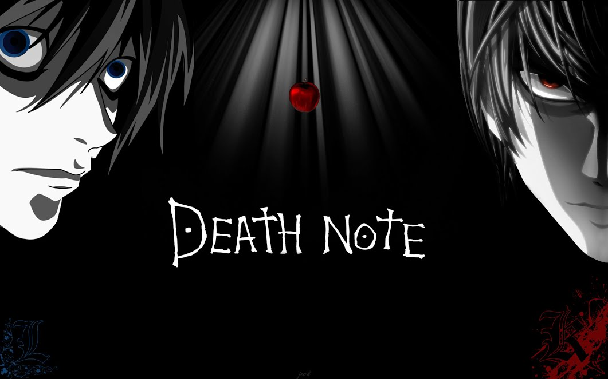

# Text generation using LSTM and Bi-LSTM on DeathNote Anime Series
## DeathNote - Anime .

### I have used LSTM model to predict the future text of deathnote anime series based on prior inputs using LSTM model .
## Label : 
### 1 - Deathnote-script.txt : This is the data which is used to train the model
### 2 - lstm-text-generation.ipynb : The LSTM notebook file for the codes
### 3 - bilstm-text-generation.ipynb : The BI-LSTM notebook file for the codes

### If you like this , do give a star :)

